<h1 align="center">Jars</h1>

<p align="center">
  <em>Percentage-based, local-first personal finance — built around <strong>your</strong> jars, not an app's categories.</em>
</p>

---

## The idea

Most budgeting apps hand you a fixed set of categories and ask you to
live inside them. **Jars** flips that: you define your own buckets and
what share of income flows into each one — a generalisation of the
"6 jars" method. Money is **tracked, not moved**; jars are allocation
rules, not accounts.

### Mission

Give students, developers and non-technical people a budgeting tool that
is:

- **Yours to shape** — every jar, percentage, sub-category and colour is
  user-defined.
- **Honest about shared money** — people who live together can share some
  jars and keep the rest completely private, per-jar. A personal jar is
  invisible to housemates by its very existence, not filtered after the
  fact.
- **Calm and truthful** — an AI coach explains and suggests in plain
  language, but every number it talks about is computed deterministically
  in code first. No hallucinated math.
- **Local-first** — works fully offline, data lives on your device first,
  syncs in the background when you want it to.
- **Open** — open source and self-hostable, no lock-in.

Full product spec: [`docs/SPEC.md`](docs/SPEC.md) · visual design:
[`docs/DESIGN-STICKER-SHEET.md`](docs/DESIGN-STICKER-SHEET.md).

## Where it's at

**Phase 1 (core ledger, single user) — in progress.** Working today:
on-device database, the full jar editor (name, %, type, colour, icon,
pattern, sub-categories), wallets, multiple income sources, a keypad
transaction-entry flow with a grouped history, and a dashboard whose
allocation donut and per-jar progress are computed live from real data —
accumulation-jar goals with a balance-over-time chart, withdrawal
events, and deterministic goal-date projections (with a coach note that
flags when a goal moves), plus the theme / accessibility modes. Next:
CSV import and PWA polish. Track it in
[`docs/ROADMAP.md`](docs/ROADMAP.md).

## Screens

The "Sticker Sheet" look, and its three accessibility modes (which
compose — dark + colour-blind-safe + calm is a valid combination):

| Default (light) | Dark |
|---|---|
| 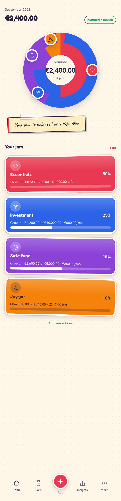 | 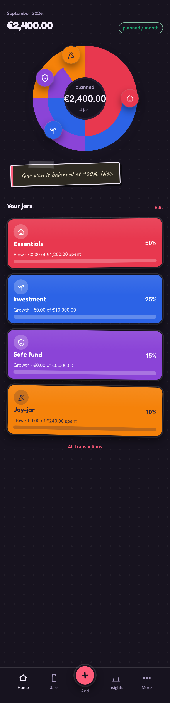 |

| Colour-blind safe (Okabe–Ito + patterns) | Calm (reduced motion & contrast) |
|---|---|
| 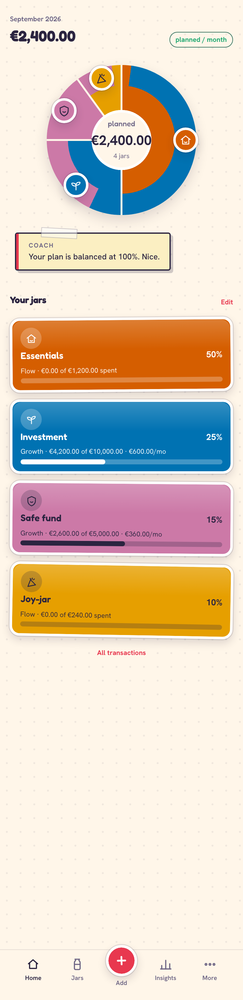 | 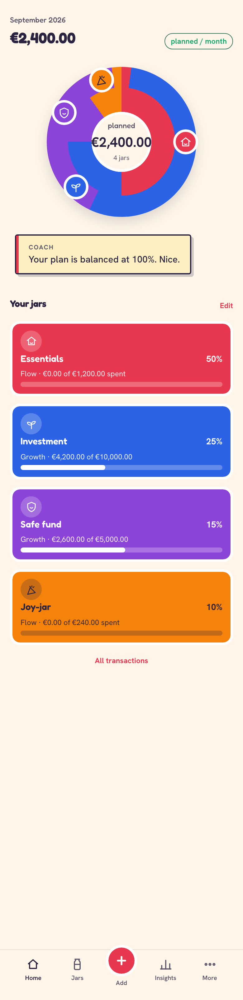 |

| Jars | Jar editor |
|---|---|
| 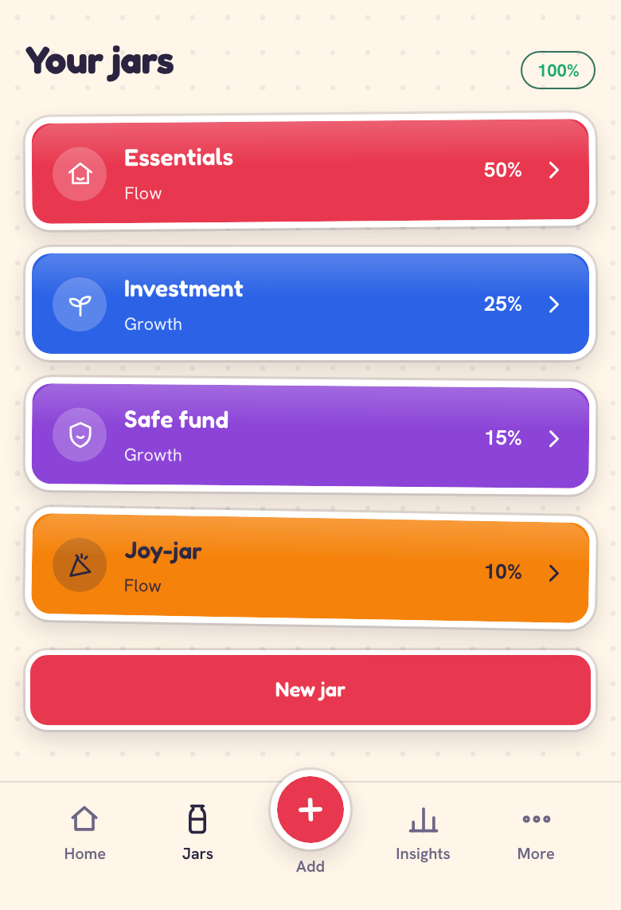 | 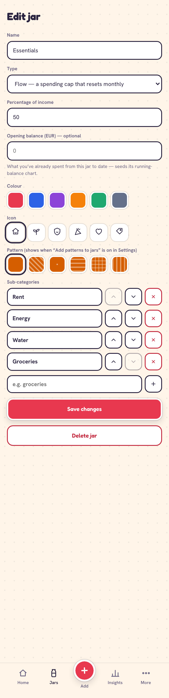 |

| Add a transaction | Transactions | Dashboard with spending |
|---|---|---|
| 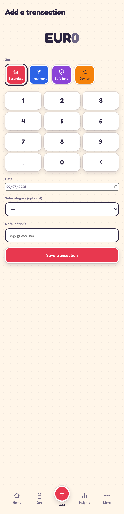 | 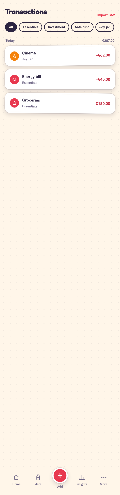 | 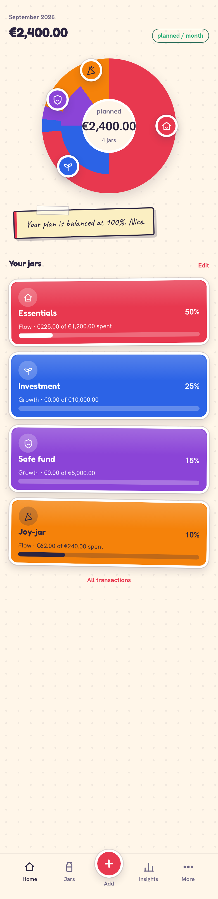 |

| Accumulation jar + projection | After a withdrawal | Insights |
|---|---|---|
| 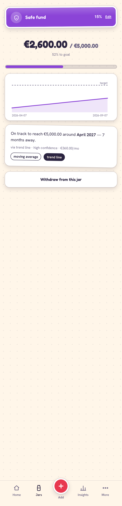 | 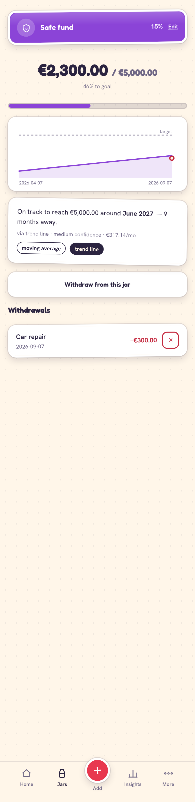 | 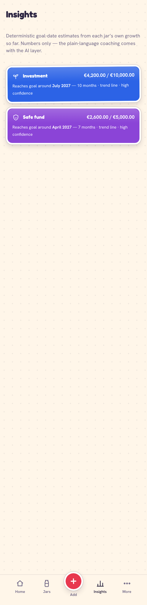 |

| Wallets | Income sources |
|---|---|
| 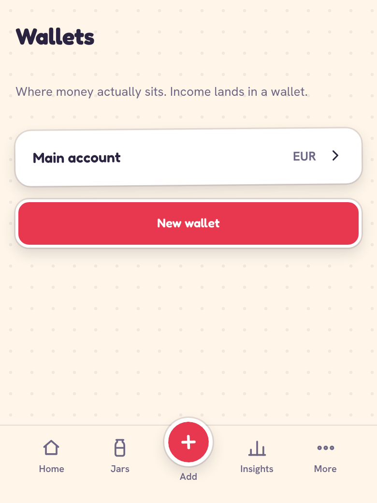 | 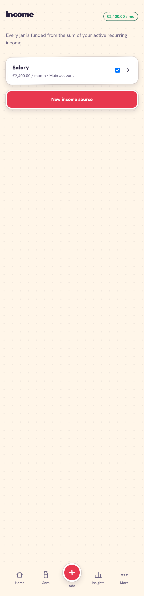 |

_Screenshots are regenerated with `npm run shots` (Playwright) as
features land._

## Data model

Two entities are deliberately decoupled: a **Wallet** is where money
actually sits (a currency + an owner); a **Jar** is an allocation rule
with a percentage that draws from one or more wallets through a
**contribution rule**. Full detail and the v1 computation model:
[`docs/DATA-MODEL.md`](docs/DATA-MODEL.md).

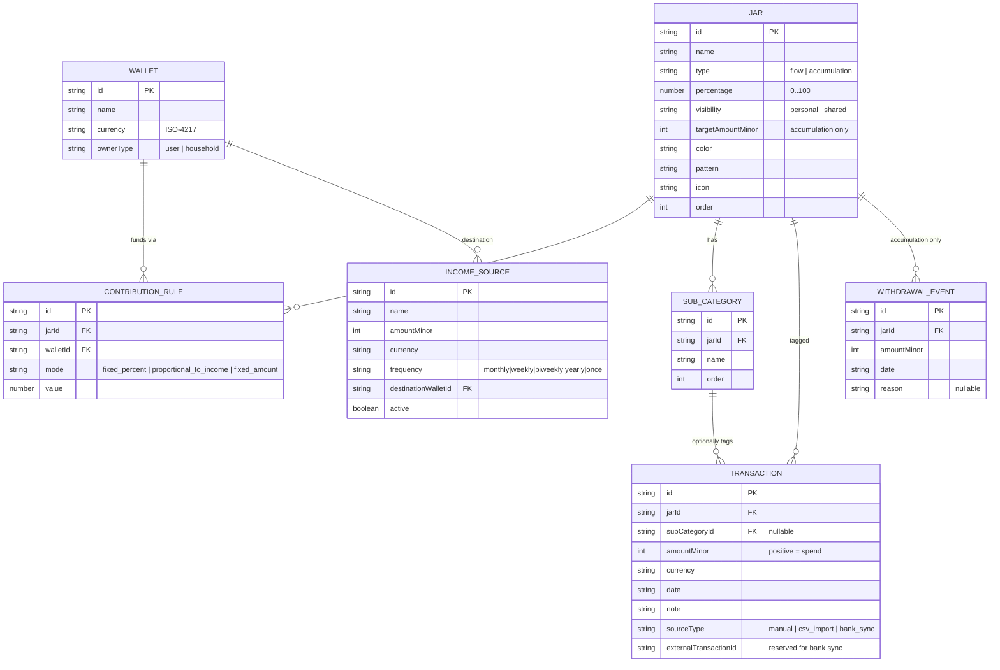

There is also an `FX_RATE` table, reserved for the Phase 2
display-currency rollup and unused in v1.

## Stack, and why

| Layer | Choice | Why |
|---|---|---|
| UI | **React + TypeScript**, Vite | Ubiquitous, strongly typed, fast dev loop. Vite gives a first-class PWA build. |
| Local database | **RxDB** over IndexedDB (`storage-dexie`) | Reactive queries, offline-first, and a **Supabase replication plugin** for later — the free/OSS storage keeps it self-hostable. |
| Styling | Hand-written CSS + custom properties, CSS Modules | The design system needs `data-theme` / `data-a11y` tokens that **compose**; plain CSS does that cleanly where a utility framework would fight it. |
| State | RxDB itself + a ~30-line `useRxQuery` hook | RxDB *is* the store. No Redux/Zustand to keep the surface small. |
| Sync / backend _(Phase 5)_ | **Supabase** (Postgres, Auth, Row-Level Security) | Passive replication endpoint; RLS enforces per-household document access so personal data never leaves the device unless shared. |
| AI _(Phase 3)_ | **Groq** via a small backend function | Narration, coaching, onboarding agent, rebalance suggestions — over numbers computed in code, never by the model. |
| FX rates _(Phase 2)_ | Frankfurter / exchangerate.host | Free tier, refreshed daily, cached so historical figures stay accurate. |
| Bank sync _(Phase 6)_ | GoCardless Bank Account Data | EU open banking, free tier. The `external*` transaction fields are reserved now so it lands without a migration. |
| Testing | Vitest + Testing Library | Fast; the money/allocation math carries the heaviest coverage. |
| Hosting | Self-hosted (Hetzner + Coolify) | Consistent with existing infra; the PWA is the distribution channel. |

Rationale in depth: [`docs/decisions/`](docs/decisions/) (ADRs) and
[`docs/ARCHITECTURE.md`](docs/ARCHITECTURE.md).

### Future plans

1. Multi-currency rollup + a period-allocation engine
2. AI layer (onboarding agent, coaching, projections)
3. Household sharing with Supabase RLS
4. Background sync, install-to-home-screen polish, CSV import
5. Real bank sync (GoCardless), richer AI rebalancing, native packaging if warranted

## Getting started

```bash
npm install
npm run dev        # http://localhost:5173
```

| Command | |
|---|---|
| `npm run dev` | dev server |
| `npm run build` | production PWA bundle |
| `npm run check` | typecheck + lint + tests (the gate) |
| `npm run test` / `npm run test:watch` | tests |
| `npm run feature <slug>` | scaffold a new feature spec |
| `npm run shots` | regenerate screenshots (needs `npm run dev` running) |

## How features get built

Spec-driven: every change is a written spec first, and the docs are
updated to match reality when it lands. The full loop and the
Claude/CLI commands are in [`docs/WORKFLOW.md`](docs/WORKFLOW.md).

```
npm run feature <slug>   →  fill docs/features/NNNN-<slug>.md
        ↓
implement to the acceptance criteria  →  npm run check
        ↓
npm run dev / npm run shots  →  verify + screenshot
        ↓
update the feature Status, ROADMAP.md, PROGRESS.md  →  commit
```

## License

MIT — see [`LICENSE`](LICENSE).
