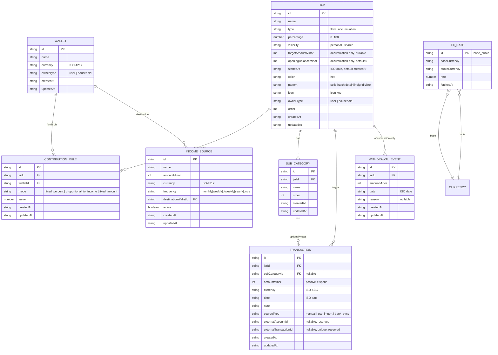

# Data Model (as built)

Mirrors `src/db/schemas/*.ts`. Update **both** together. Conceptual model
is [`SPEC.md`](SPEC.md) §9; this file is the concrete v1 shape.

## Conventions

- Every collection has: `id` (string, `crypto.randomUUID()`, primary
  key), `createdAt`, `updatedAt` (ISO 8601 strings). Soft-delete via
  RxDB's `_deleted`.
- Money: `*Minor` integer fields (cents) + a sibling ISO-4217 `currency`.
- Enums are lowercase string unions, validated by the JSON schema.
- `updatedAt` is bumped on every write — it is the tiebreaker for the
  future last-write-wins sync (Phase 5).

## Entity–relationship diagram

## Collections & indexes (v1)

| Collection | Schema file | Indexes |
|---|---|---|
| `wallets` | `schemas/wallet.ts` | `updatedAt` |
| `jars` | `schemas/jar.ts` | `order`, `updatedAt` |
| `contributionRules` | `schemas/contributionRule.ts` | `jarId`, `walletId` |
| `subCategories` | `schemas/subCategory.ts` | `jarId` |
| `incomeSources` | `schemas/incomeSource.ts` | `active`, `updatedAt` |
| `transactions` | `schemas/transaction.ts` | `jarId`, `date`, `externalTransactionId` |
| `withdrawalEvents` | `schemas/withdrawalEvent.ts` | `jarId`, `date` |
| `fxRates` | `schemas/fxRate.ts` | `fetchedAt` |

## v1 computation model (deterministic, in `*/compute.ts`)

Because there is no period-allocation engine yet (Phase 2), progress is
derived on read:

- **Monthly income** = Σ over `active` income sources of `amountMinor`
  normalised to monthly (`weekly ×52/12`, `biweekly ×26/12`,
  `yearly ×1/12`, `once → 0`). v1 assumes one currency.
- **Jar planned / month** = `round(monthlyIncome × percentage / 100)`.
- **Flow jar — spent this month** = Σ `transactions` for the jar dated in
  the current calendar month. Progress = `spent / planned`.
- **Accumulation jar — balance** =
  `openingBalanceMinor + wholeMonthsSince(startedAt) × plannedPerMonth
   − Σ withdrawalEvents`, clamped ≥ 0. Progress = `balance / targetAmountMinor`.
- **Flow jar — running balance** =
  `openingBalanceMinor + wholeMonthsSince(startedAt) × plannedPerMonth
   − Σ transactions`, clamped ≥ 0 (`flowRunningBalanceMinor`). This is a
  *secondary* view — the flow jar's primary metric stays spent-this-month
  vs. cap. Opening balance is now settable on any jar type.
- The jar-detail chart (`jars/timeline.ts` — `buildBalanceTimeline(jar,
  monthlyCreditMinor, debits, ref)`) expands whichever of the two applies
  into a point series: the monthly credit accrues at each whole-month
  boundary, each `DebitEvent` (a withdrawal, or a transaction for a flow
  jar) subtracts on its date, and the final point equals the balance
  above.
- **Plan health** = `Σ jar.percentage`. `= 100` balanced; `≠ 100`
  surfaces an actionable coach note (rule-based in v1; AI-worded in Phase 3).
- **Projections** (`projections/project.ts`) are fully derived — nothing
  is stored. `projectGoalDate` runs EMA / least-squares over
  `monthlyBalanceSeries` to estimate a goal date; the previous run is
  kept in memory (`projections/tracker.ts`) only so the coach note can
  name the biggest shift. Recompute is synchronous with the data change.

## Schema versioning

All schemas start at `version: 0`. Any breaking field change bumps the
version and adds a `migrationStrategies` entry in `database.ts`. Record
the change in this file's history below and in `PROGRESS.md`.

## Implementation notes

- `jars.targetAmountMinor` is `["integer", "null"]`;
  `jars.openingBalanceMinor` is a required integer defaulted to `0` by
  the seed/repo (not a schema `default`).
- Only `jarId` / `walletId` / `date` are indexed (all strings with
  `maxLength`). Numeric fields like `order` are **not** indexed — lists
  are sorted in memory (datasets are small). RxDB rejects sorting by a
  non-indexed field, so components must `.sort()` after the query.
- No automatic seed. `firstRunDecision()` routes a new user to
  `/welcome`; jars are created either from the questionnaire
  (`buildFromProposal`) or from `seedExampleData()` (the "skip" path).
- `localStorage` `jarin.preferences` also holds
  `onboarding: 'pending' | 'done' | 'skipped'` and `tourDone: boolean`
  (feature 0011). Not in RxDB.
- Deleting a `subCategories` row patches `subCategoryId` to `null` on any
  `transactions` that referenced it (they report at jar level instead).
  Sub-category `order` is kept contiguous (0..n) by the reorder repo.
- CSV import writes `transactions.sourceType = "csv_import"` and leaves
  `externalAccountId` / `externalTransactionId` null. Re-import dedupe is
  **session-only** (an in-memory hash set of
  `date|amountMinor|normalised-note`), not a DB constraint — durable
  dedupe is bank sync's job via `externalTransactionId`.
- Dev builds wrap the Dexie storage in `wrappedValidateAjvStorage`
  (RxDB dev-mode requires a top-level validator).

## History

- **2026-09-06** — v0 of all 8 schemas created for Phase 1.
